<h1 align="center">
  <br>
  YouTube's Recycle Bin
  <br>
  <sub>Interactive Game Tool for <a href="https://www.youtube.com/@KVNAUST">KVN AUST</a></sub>
  <br>
</h1>

<p align="center">
  <a href="https://falcontechnix.com/KVN_AUST/"></a>
</p>

<p align="center">
  <a href="https://www.youtube.com/@KVNAUST"></a>
  <a href="https://x.com/MingKasterMK"></a>
  <a href="FORMAT-MAP.md"></a>
  <a href="LICENSE"></a>
  <a href="CHANGELOG.md"></a>
</p>

<p align="center">
  <a href="FORMAT-MAP.md"></a>
  <a href="FORMAT-MAP.md#search-keyphrases"></a>
  <a href="FORMAT-MAP.md#file-extensions"></a>
  <a href="FORMAT-MAP.md#numbered-formats"></a>
  <a href="FORMAT-MAP.md#date-based-formats"></a>
  <a href="FORMAT-MAP.md#ancient-youtube-2006-2008"></a>
</p>

---

YouTube hosts over **20 billion videos**. An estimated **6 billion** have fewer than 10 views. **Over 1 billion** have exactly **zero views** — uploaded and never watched by a single human being. These are videos with default device filenames like `IMG 0001`, `DSCF0042`, or `MOV 0037`, uploaded and immediately forgotten.

KVN AUST's **YouTube Recycle Bin** series explores this massive graveyard of forgotten content. This tool generates random search strings from those default filename patterns to help you discover zero-view YouTube videos yourself.

> **[The Complete Recycle Bin Format Map](FORMAT-MAP.md)** — Every known default filename keyphrase, range, source device, and contributor credit. Community-maintained.

---

## What It Does

| Step | Feature | Description |
|:----:|:--------|:------------|
| 1 | **Recycle Bin Bingo** | Randomized 5x5 bingo card with 101 video categories from KVN AUST's series. Slide-puzzle reveal animation. 50 unique SVG daub stamps per game. |
| 2 | **Format Spinner** | 3D-textured wheel loaded with 60+ filename formats from the [Recycle Bin Format Map](FORMAT-MAP.md). No-repeat spins with red dots marking used formats. |
| 3 | **Rainbow Number Generator** | Character-by-character rainbow shuffle animation generates the random search number for your format. |
| 4 | **Search YouTube & Rate** | Copy the search string, open directly in YouTube, or re-randomize. Rate each video on Entertainment, Weirdness, Gem Factor, and "I Just Liked It." Log date posted, views, and channel size. Share via SVG card or copy for Discord. |
| 5 | **Game Summary & Export** | End-of-session recap with video thumbnails, per-metric breakdowns, and averages. Export bingo cards and summaries as SVG. |
| 6 | **Oldest Zero-View Record** | Track the oldest zero-view videos you discover on a canvas timeline with rarity zones — from YouTube's launch in 2005 to present day. |

---

## Screenshots

<p align="center">
  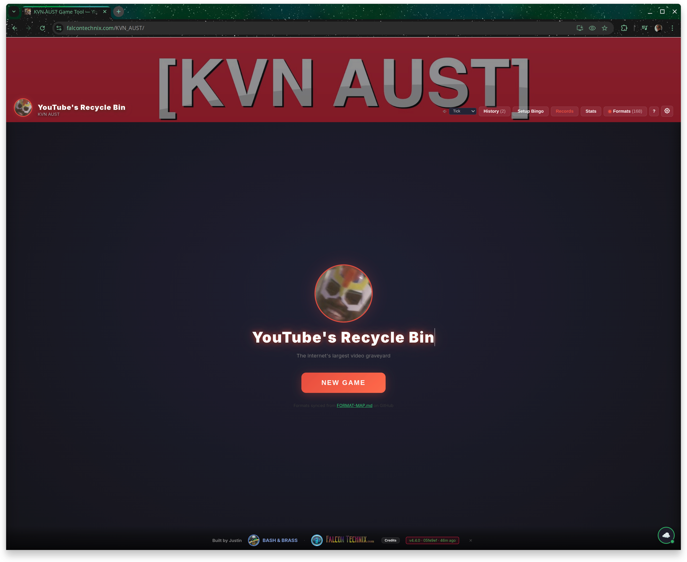
  <br><sub>Start Screen — YouTube's Recycle Bin</sub>
</p>

<p align="center">
  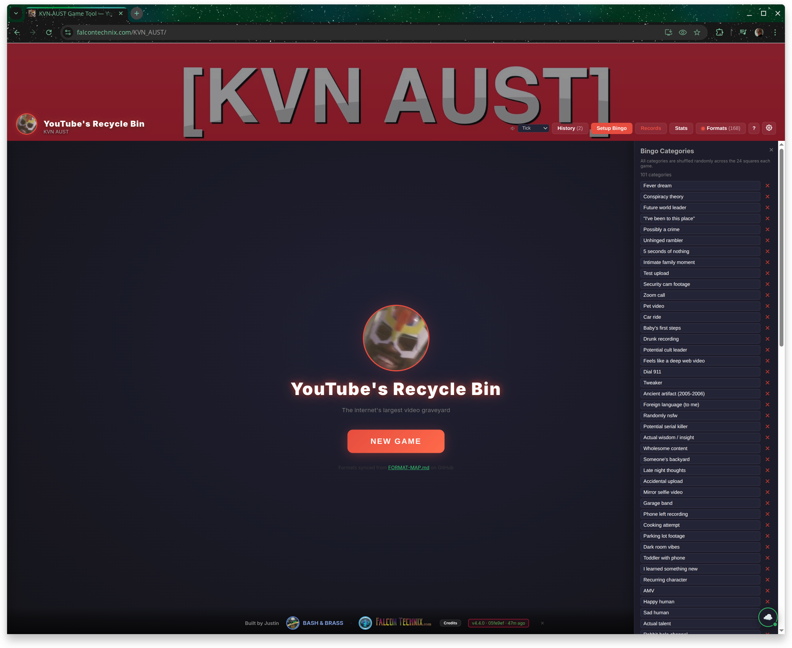
  <br><sub>Bingo Setup — 101 customizable categories</sub>
</p>

<p align="center">
  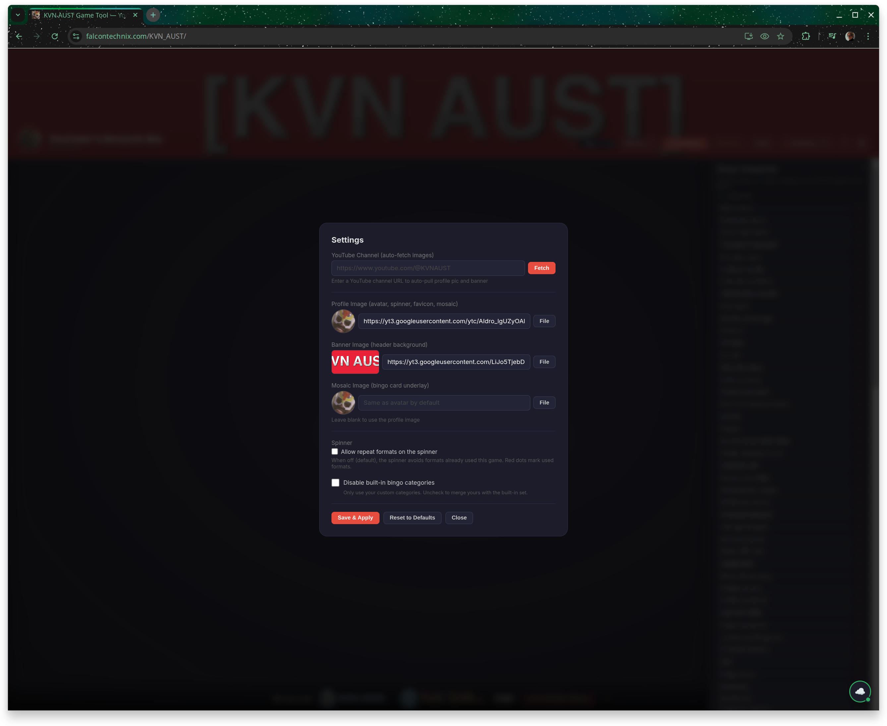
  <br><sub>Settings — channel images, spinner options, daub colors</sub>
</p>

<p align="center">
  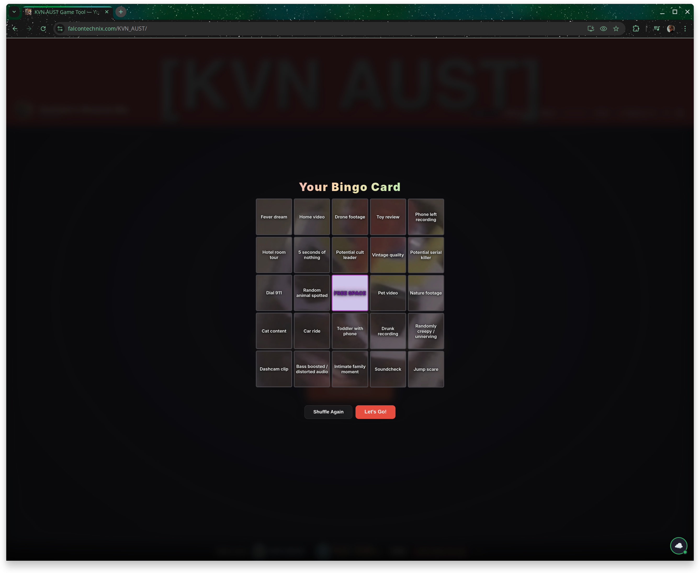
  <br><sub>Bingo Card Reveal — slide puzzle with mosaic</sub>
</p>

<p align="center">
  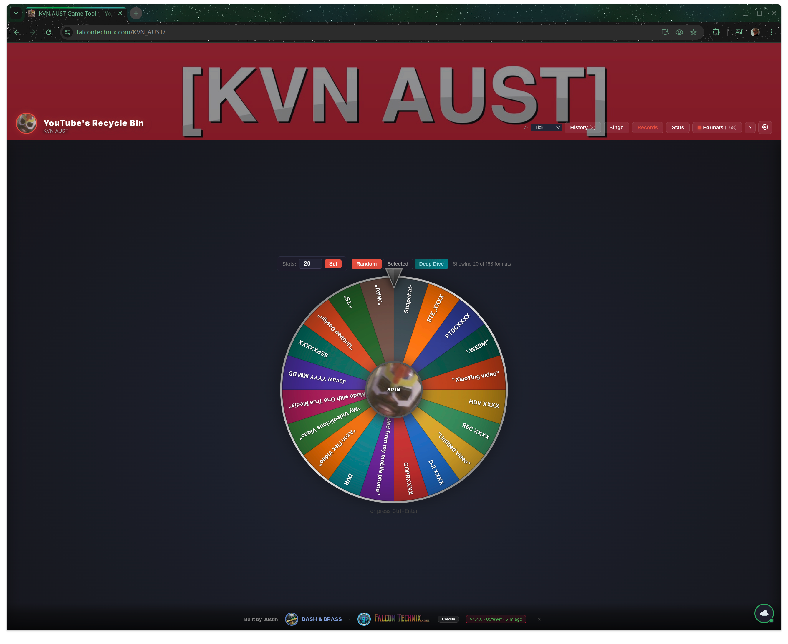
  <br><sub>3D Format Spinner — 170+ formats from the community map</sub>
</p>

<p align="center">
  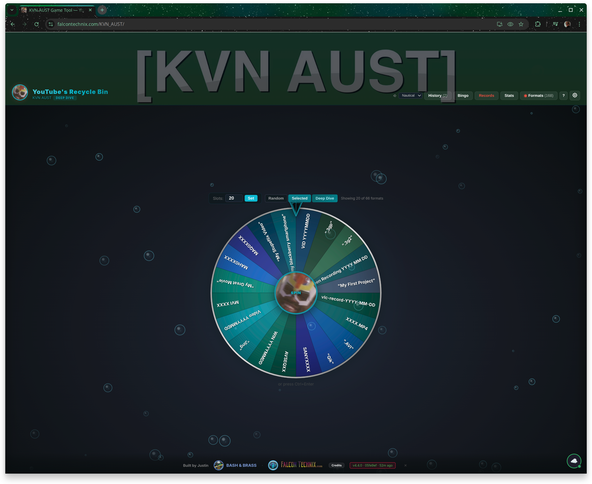
  <br><sub>Deep Dive Mode — underwater theme, Before:2010 filter, nautical sounds</sub>
</p>

<p align="center">
  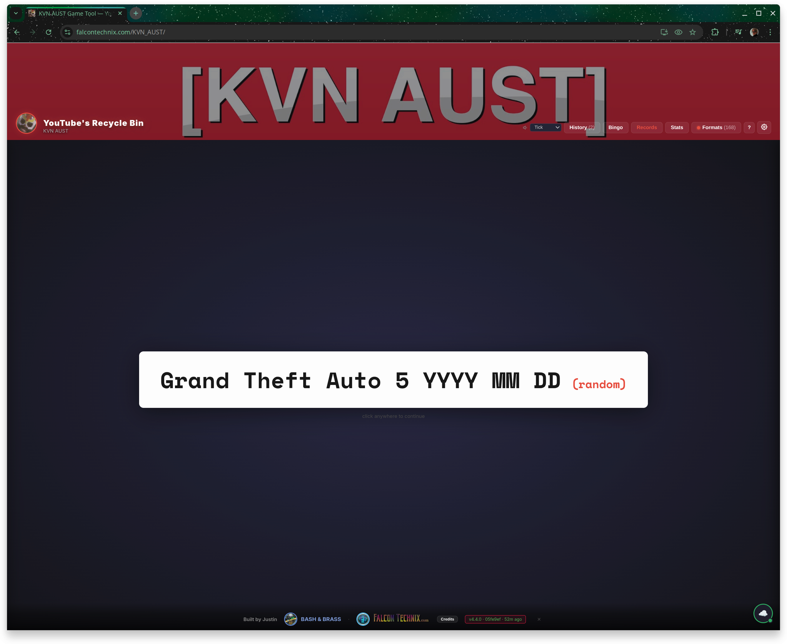
  <br><sub>Format Selected — rainbow reveal animation</sub>
</p>

<p align="center">
  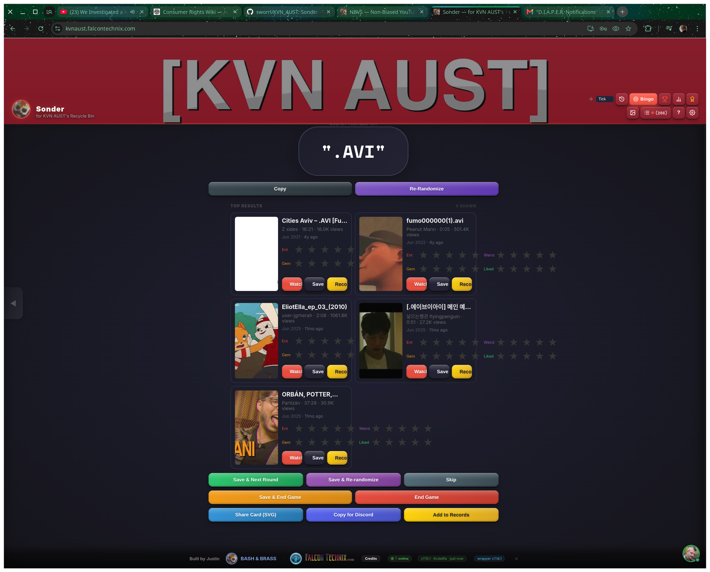
  <br><sub>Search, Rate & Save — auto-fetch video stats, share to Discord</sub>
</p>

<p align="center">
  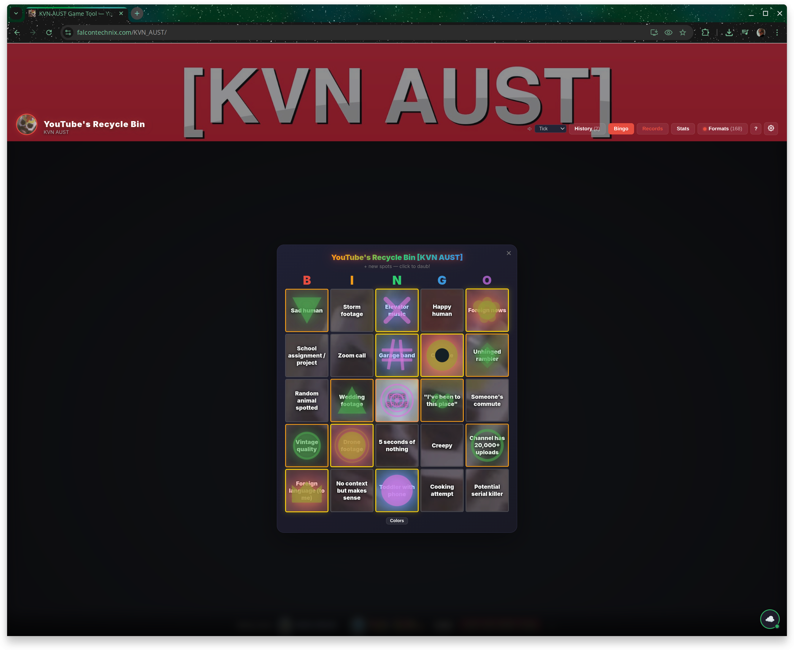
  <br><sub>Live Bingo Card — progressive daub stamps that glow near BINGO</sub>
</p>

<p align="center">
  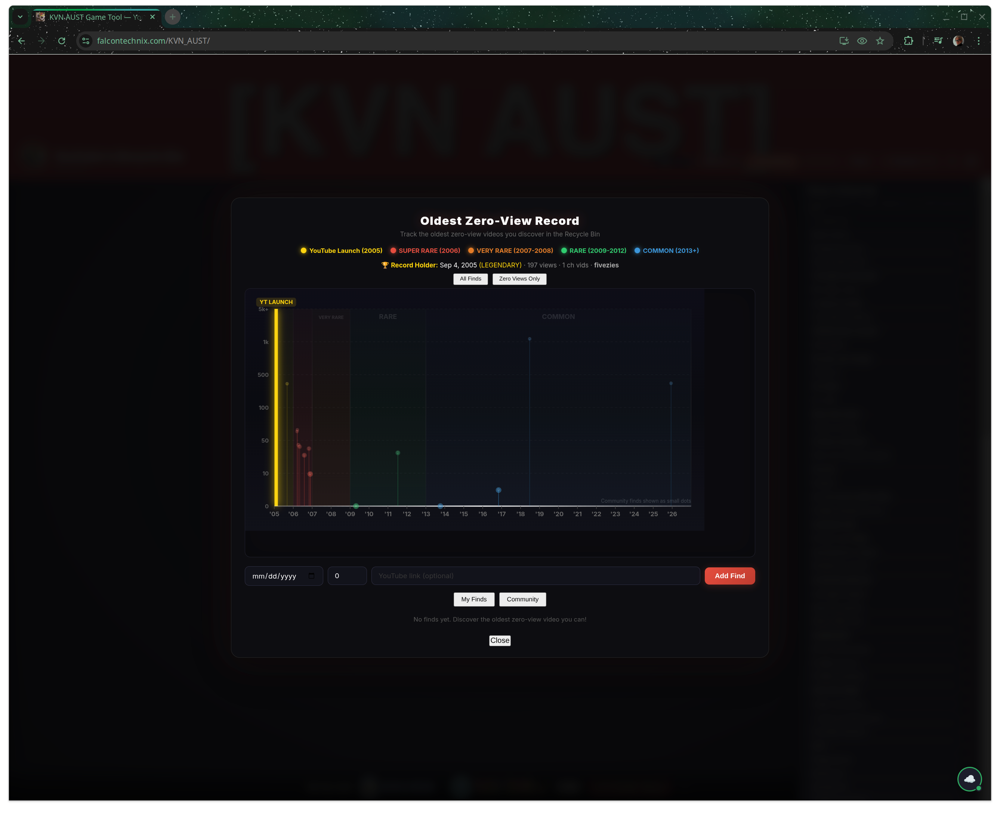
  <br><sub>Oldest Zero-View Records — community leaderboard with rarity tiers</sub>
</p>

<p align="center">
  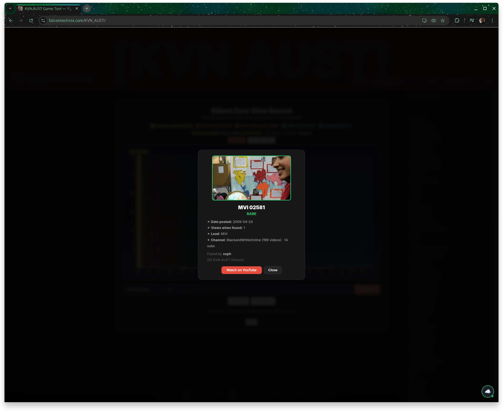
  <br><sub>Find Detail — click any dot for video info, channel stats, attribution</sub>
</p>

---

## Features

<table>
<tr><td>

**Core**
- Single HTML file — no install, no build step, no dependencies
- Works offline from `file://` or any web server
- Runs on Windows, Mac, Linux, Chromebook — any browser
- Auto-update checking against this GitHub repo
- Embedded Web Audio sound effects (tick, retro, casino presets)

</td><td>

**Online (Hosted)**
- Live format sync from [FORMAT-MAP.md](FORMAT-MAP.md) every 30 minutes
- Password-backed cloud save for game history
- Always running the latest version

</td></tr>
<tr><td>

**Recycle Bin Bingo**
- 101 categories from KVN AUST originals + community submissions
- Mosaic of KVN AUST's profile image through bingo cells
- Slide-puzzle reveal animation with real 15-puzzle physics
- BINGO detection with confetti explosion & screen shake
- Customizable daub colors & 50 unique SVG stamp designs
- Export completed cards as SVG

</td><td>

**Tracking & Scoring**
- 4 rating metrics: Entertainment, Weirdness, Gem Factor, "I Just Liked It"
- Full game and round history saved in localStorage
- Oldest Zero-View Record timeline with rarity zones
- Per-game and all-time score averages
- Export game summaries as SVG

</td></tr>
</table>

---

## Play Now

### Online (Recommended)

> **[Play YouTube's Recycle Bin at falcontechnix.com/KVN_AUST](https://falcontechnix.com/KVN_AUST/)** — always up to date, cloud save, community leaderboard, and more.

The hosted version wraps the same HTML file from this repo with additional features:

| Feature | Hosted | Standalone |
|:--------|:------:|:----------:|
| Full game (spinner, bingo, rating, export) | Yes | Yes |
| Format sync from FORMAT-MAP.md | Yes | Yes |
| Deep Dive mode | Yes | Yes |
| Share Card / Discord copy | Yes | Yes |
| **Cloud Save** — game history, bingo state, settings synced across devices | Yes | No |
| **Welcome Back** — resume in-progress games, see your stats on return | Yes | No |
| **Community Finds** — live leaderboard of oldest zero-view discoveries from the community | Yes | Fetch only |
| **Auto-updates** — new versions deploy within 5 minutes of a push to this repo | Yes | Manual download |
| **Version badge** — shows current version, sync status, countdown to next check | Yes | Basic |
| **Bingo capture** — completed bingo cards saved and synced automatically | Yes | Local only |
| **PWA install** — add to home screen as a standalone app | Yes | No |

### Offline / Standalone

Download [`kvnaust-recyclebin.html`](kvnaust-recyclebin.html) and [`bingo-categories.json`](bingo-categories.json), place them in the same folder, and open in any browser. Everything runs locally — no internet required after download. Formats still sync from GitHub on first load if online.

---

## Community Finds API

The hosted version serves a public API of community-discovered zero-view YouTube videos at [`/KVN_AUST/finds.php`](https://falcontechnix.com/KVN_AUST/finds.php). The standalone HTML polls this automatically.

- **Rate limit**: 3 requests per 60 seconds per IP (conditional GET with ETag doesn't count)
- **14+ seeded finds** spanning 2005 to 2025, sourced from the KVN AUST Discord
- **Rarity tiers**: LEGENDARY (2005), SUPER RARE (2006), VERY RARE (2007-2008), RARE (2009-2012), COMMON (2013+)
- Each find includes: video URL, title, channel, date posted, views when found, lead used, who found it, and which server

Query with `?category=camera-img`, `?source=discord`, `?since=2026-01-01T00:00:00`, `?order=desc`, `?limit=100`.

### Direct Links

| Link | Opens |
|:-----|:------|
| [falcontechnix.com/KVN_AUST/#records](https://falcontechnix.com/KVN_AUST/#records) | Records Timeline & Community Leaderboard |
| [falcontechnix.com/KVN_AUST/#stats](https://falcontechnix.com/KVN_AUST/#stats) | Stats Dashboard |
| [falcontechnix.com/KVN_AUST/#credits](https://falcontechnix.com/KVN_AUST/#credits) | Credits & Contributors |
| [falcontechnix.com/KVN_AUST/#shortcuts](https://falcontechnix.com/KVN_AUST/#shortcuts) | Keyboard Shortcuts |

### Community Leaderboard

> This table auto-updates every 3 hours from the [Finds API](https://www.falcontechnix.com/KVN_AUST/finds.php) via GitHub Actions. Do not edit manually — changes will be overwritten.
>
> **Get on the leaderboard:** [Play the hosted version](https://falcontechnix.com/KVN_AUST/) and create an account. Submit a validated zero-view video during gameplay or directly via the [Records timeline](https://falcontechnix.com/KVN_AUST/#records) — you don't need to play a full game to submit a find. See also: [Discord Integration Guide](DISCORD_INTEGRATION.md)

<!-- LEADERBOARD-START -->
**14 community finds** — oldest: 2005-09-05 · newest: 2025-12-10

| # | Rarity | Date Posted | Views | Lead | Found By |
|:-:|:-------|:-----------|------:|:-----|:---------|
| 🥇 | 🏆 LEGENDARY | [2005-09-05](https://youtube.com/watch?v=ExMSFNh7Sp0) | 197 | `testing before:2007` | fivezies |
| 🥈 | 🔴 SUPER RARE | [2006-03-14](https://youtube.com/watch?v=7tH0sdugVEU) | 25 | `good show` | susgod_bro_69 |
| 🥉 | 🔴 SUPER RARE | [2006-03-20](https://youtube.com/watch?v=oP8jSAmt1M8) | 27 | `new` | susgod_bro_69 |
| 4 | 🔴 SUPER RARE | [2006-04-11](https://youtube.com/watch?v=qnBuwBBNeF0) | 14 | `kelly 5` | susgod_bro_69 |
| 5 | 🔴 SUPER RARE | [2006-05-04](https://youtube.com/watch?v=DuI02uPgDOs) | 13 | `testing before:2007` | fivezies |
| 6 | 🔴 SUPER RARE | [2006-08-01](https://youtube.com/watch?v=hzvZ2MtjrtA) | 9 | `You have new Picture M...` | fivezies |
| 7 | 🔴 SUPER RARE | [2006-10-30](https://youtube.com/watch?v=KeOXi_GyFdk) | 12 | `dustin before:2007` | Ross from wii music |
| 8 | 🔴 SUPER RARE | [2006-11-24](https://youtube.com/watch?v=kj0CI8tQzbE) | 4 | `testing before:2007` | Ross from wii music |
| 9 | 🟢 RARE | [2009-04-24](https://youtube.com/watch?v=o2DY-QOs6RY) | 1 | `MVI` | soph |
| 10 | 🟢 RARE | [2011-07-09](https://youtube.com/watch?v=z-QCzV5FLWk) | 10 | `.mts` | Ross from wii music |

*Live leaderboard at [falcontechnix.com/KVN_AUST/#records](https://falcontechnix.com/KVN_AUST/#records) · [API endpoint](https://www.falcontechnix.com/KVN_AUST/finds.php)*
<!-- LEADERBOARD-END -->

---

## The Recycle Bin Format Map

> **[VIEW THE COMPLETE FORMAT MAP](FORMAT-MAP.md)**

The community-maintained database of every known default filename keyphrase that surfaces YouTube's hidden zero-view video graveyard. Organized by search keyphrases, file extensions, numbered device formats, date-based formats, and ancient YouTube (2006-2008) patterns. 60+ numbered formats with ranges, 70+ contributors.

---

## Bingo Categories

[`bingo-categories.json`](bingo-categories.json) contains 101 categories compiled from KVN AUST's original Recycle Bin bingo cards and community fan variants.

- **Hosted**: fetched automatically at load time
- **Offline**: place the JSON next to the HTML (embedded fallback if missing)
- **Editable**: customize via the Setup Bingo panel or edit the JSON directly

---

## Contributing

1. **New format leads**: Add to [FORMAT-MAP.md](FORMAT-MAP.md) via PR. Numbered formats must follow this table syntax for the spinner parser:
   ```
   | `formatXXXX` | 0000-9999 | Source | Credit |
   ```
   Keyphrase in backticks, ending with 2-4 `X` characters, range as `MIN-MAX` digits.
2. **New bingo categories**: Add to [`bingo-categories.json`](bingo-categories.json) via PR
3. **Code changes**: Edit [`kvnaust-recyclebin.html`](kvnaust-recyclebin.html) and bump the version block at the bottom of the file

---

## Credits

- **[KVN AUST](https://www.youtube.com/@KVNAUST)** ([@MingKasterMK](https://x.com/MingKasterMK)) — Creator of YouTube's Recycle Bin series & the Format Maps
- **Justin** ([@Chegnus](https://x.com/Chegnus)) / [BASH & BRASS](https://www.youtube.com/@BASHnBRASS) / [FalconTechnix](https://www.falcontechnix.com) — Tool Development
- **[70+ community contributors](FORMAT-MAP.md#contributors)** — Format discovery & verification

---

<p align="center">
  <sub>GPL-3.0 | <a href="https://github.com/sworrl/KVN_AUST">GitHub</a> | <a href="https://falcontechnix.com/KVN_AUST/">Play Now</a> | <a href="FORMAT-MAP.md">Format Map</a> | <a href="SOLVED_MYSTERIES.md">Solved Mysteries</a> | <a href="DISCORD_INTEGRATION.md">Discord</a> | <a href="CHANGELOG.md">Changelog</a></sub>
</p>
