<h1 align="center">
  <br>
  Sonder
  <br>
  <sub><em>a tool for <a href="https://www.youtube.com/@KVNAUST">KVN AUST</a>'s YouTube Recycle Bin</em></sub>
  <br>
</h1>

<p align="center">
  <a href="https://kvnaust.falcontechnix.com/"></a>
  <a href="https://nbvs.falcontechnix.com/"></a>
</p>

> ***sonder***, *n.* the realization that each random passerby is living a life as vivid and complex as your own, populated with their own ambitions, friends, routines, worries and inherited craziness, an epic story that continues invisibly around you like an anthill sprawling deep underground, with elaborate passageways to thousands of other lives that you'll never know existed, in which you might appear only once, as an extra sipping coffee in the background, as a blur of traffic passing on the highway, as a lighted window at dusk.
>
>, John Koenig, *[The Dictionary of Obscure Sorrows](https://www.dictionaryofobscuresorrows.com/post/23536922667/sonder)*

KVN AUST said it best in the preface of his Recycle Bin Map: *"This feels like sonder, like the way YouTube used to be."* That's the entire pitch for this tool. Every spin pulls up someone's nephew's recital from 2009 that nobody else has ever clicked. Their whole life, one click away, entirely unwitnessed.

> **Heads up: naming.** **Sonder** is the name of *this tool*. **YouTube's Recycle Bin** is **KVN AUST's** term for the *content* (the graveyard of zero-view videos this tool helps you explore). The two names are intentionally distinct so KVN's series identity stays his and we don't claim it.

<p align="center">
  <a href="https://www.youtube.com/@KVNAUST"></a>
  <a href="https://x.com/MingKasterMK"></a>
  <a href="FORMAT-MAP.md"></a>
  <a href="LICENSE"></a>
  <a href="CHANGELOG.md"></a>
  <a href="CHANGELOG.md#700--2026-05-03--the-go-rewrite"></a>
</p>

<p align="center">
  <a href="FORMAT-MAP.md"></a>
  <a href="FORMAT-MAP.md#search-keyphrases"></a>
  <a href="FORMAT-MAP.md#file-extensions"></a>
  <a href="FORMAT-MAP.md#numbered-formats"></a>
  <a href="FORMAT-MAP.md#date-based-formats"></a>
  <a href="FORMAT-MAP.md#ancient-youtube-2006-2008"></a>
</p>

---

YouTube hosts over **20 billion videos**. An estimated **6 billion** have fewer than 10 views. **Over 1 billion** have exactly **zero views**, uploaded and never watched by a single human being. These are videos with default device filenames like `IMG 0001`, `DSCF0042`, or `MOV 0037`, uploaded and immediately forgotten.

KVN AUST's **YouTube Recycle Bin** series explores this massive graveyard of forgotten content. **Sonder** generates random search strings from those default filename patterns to help you discover zero-view YouTube videos yourself.

> **[The Complete Recycle Bin Format Map](FORMAT-MAP.md)**: Every known default filename keyphrase, range, source device, and contributor credit. Community-maintained, 136 contributors. Synced with **KVN AUST's Map 5.0** (183 new leads; all 444 leads in KVN's doc audited against the live parser), [announcement post on X](https://x.com/MingKasterMK/status/2077144462589895067).

### Versions at a glance

| What | Version | Where it lives |
|:-----|:--------|:---------------|
| Sonder game HTML (this repo, GPL-3.0) | **7.20.0** "The QoL Drop" (2026-07-16) | [`kvnaust-recyclebin.html`](kvnaust-recyclebin.html) · [changelog](CHANGELOG.md) |
| Sonder hosted wrapper (proprietary) | **7.15.6** | [kvnaust.falcontechnix.com](https://kvnaust.falcontechnix.com/) · [wrapper changelog](WRAPPER_CHANGELOG.md) |
| NBVS upstream (KVN AUST, GPL-3.0) | commit `6824f25` (2026-07-15) | [kvnaust/YouTube-NonBiasedVideoSearcher](https://github.com/kvnaust/YouTube-NonBiasedVideoSearcher) |
| NBVS Falcon Technix mirror wrapper | **2.7.1** (2026-09-24) | [nbvs.falcontechnix.com](https://nbvs.falcontechnix.com/), version shown in the page footer |
| Format Map | KVN Map 5.0 sync | [`FORMAT-MAP.md`](FORMAT-MAP.md) |

The game version and the wrapper versions move independently. A change to the HTML bumps the game version; a change to hosting, proxying or the community layer bumps a wrapper version. The hosted pages print all of them in their footers so you can tell what you're running.

---

## Sonder vs. NBVS: Two Tools, One Mission

> KVN AUST's community built two search tools that approach the same graveyard from different angles. They're complementary, and Sonder ships with NBVS's engine built in as an optional **Power Search** mode.

<table>
<tr>
<th align="left" width="38%"></th>
<th align="center" width="31%">
  🎮 Sonder<br>
  <sub><a href="https://kvnaust.falcontechnix.com/">kvnaust.falcontechnix.com</a></sub>
</th>
<th align="center" width="31%">
  🔍 NBVS<br>
  <sub><a href="https://nbvs.falcontechnix.com/">nbvs.falcontechnix.com</a> · <a href="https://kvnaust.github.io/YouTube-NonBiasedVideoSearcher/">GitHub Pages</a></sub>
</th>
</tr>
<tr>
<td><strong>YouTube API key required</strong></td>
<td align="center">❌ Never (optional for Power Search)</td>
<td align="center">❌ Optional at FT Mirror · ✅ Required on GitHub Pages</td>
</tr>
<tr>
<td><strong>Rate limits</strong></td>
<td align="center">None, opens YouTube directly</td>
<td align="center">None at FT Mirror (server proxy) · ~100 searches/day per key on GitHub Pages (10,000 quota units, 100 per search)</td>
</tr>
<tr>
<td><strong>API usage counter</strong></td>
<td align="center">n/a</td>
<td align="center">✅ FT Mirror shows units used today against the quota, with reset countdown</td>
</tr>
<tr>
<td><strong>Algorithm bias</strong></td>
<td align="center">Bypassed, raw filename search, no watch-history influence</td>
<td align="center">Still uses YouTube's search index</td>
</tr>
<tr>
<td><strong>In-page results with view counts</strong></td>
<td align="center">⚡ <strong>Power Search</strong> (optional API key) · hosted version shows top 5 without a key</td>
<td align="center">✅ Always</td>
</tr>
<tr>
<td><strong>Sort by views low → high</strong></td>
<td align="center">⚡ Power Search</td>
<td align="center">✅</td>
</tr>
<tr>
<td><strong>Filter Shorts</strong></td>
<td align="center">⚡ Power Search</td>
<td align="center">✅</td>
</tr>
<tr>
<td><strong>Region filter</strong></td>
<td align="center">❌</td>
<td align="center">✅ FT Mirror, 16 countries</td>
</tr>
<tr>
<td><strong>Format spinner</strong> (426 auto-loaded formats)</td>
<td align="center">✅</td>
<td align="center">Format Finder panel at FT Mirror</td>
</tr>
<tr>
<td><strong>Deep Dive mode</strong> (Before:2010 + theme)</td>
<td align="center">✅</td>
<td align="center">❌</td>
</tr>
<tr>
<td><strong>Community leaderboard</strong></td>
<td align="center">✅ Live API</td>
<td align="center">❌</td>
</tr>
<tr>
<td><strong>Personal records + rating</strong></td>
<td align="center">✅</td>
<td align="center">❌</td>
</tr>
<tr>
<td><strong>Recycle Bin Bingo</strong></td>
<td align="center">✅</td>
<td align="center">❌</td>
</tr>
<tr>
<td><strong>Cloud save / profiles</strong></td>
<td align="center">✅ Hosted</td>
<td align="center">☁ Sonder sign-in link at FT Mirror</td>
</tr>
<tr>
<td><strong>Themes</strong></td>
<td align="center">Default + Deep Dive app themes · 32 rotating wheel palettes</td>
<td align="center">11 themes at FT Mirror</td>
</tr>
<tr>
<td><strong>Works fully offline</strong></td>
<td align="center">✅ PWA, single HTML file</td>
<td align="center">❌ API required</td>
</tr>
<tr>
<td><strong>Google Dorks</strong> (before:, after:, "")</td>
<td align="center">✅ Baked into format engine, plus year-filter chips</td>
<td align="center">✅ (exact-title mode keeps dorks intact since upstream `6824f25`)</td>
</tr>
</table>

<p align="center">
  
  
  
</p>

> **Power Search** is an optional in-page search engine adapted from [NBVS](https://github.com/kvnaust/YouTube-NonBiasedVideoSearcher) and built directly into Sonder. Add a free YouTube Data API key in Settings to unlock real view counts, sort by fewest views (the gem-hunting mode), filter Shorts, and load 50 results at a time, right inside the game. No key? Everything works exactly as before: the spinner generates your format, you open it in YouTube. No setup, no limits, no expiry. On the hosted version, the top 5 results per round load through our server without any key at all.

---

## More Community Tools

> Other tools from KVN AUST's community, as listed in the [Map 5.0 doc](https://x.com/MingKasterMK/status/2077144462589895067). Each approaches the graveyard its own way.

| Tool | By | What it does |
|:-----|:---|:-------------|
| [Abysstube](https://youtuube.neocities.org/abysstube) · [YouTube Abyss](https://youtuube.neocities.org/youtube_abyss) | @juulian97 | Randomly search obscure videos by leveraging default filename conventions |
| [NoViewTube](https://www.noviewtube.com/) | | Uncover hidden, unwatched, and strange videos in YouTube's forgotten corners |
| [YouTube Recycle Bin Explorer](https://thearmagan.github.io/youtube-recycle-bin/) | @TheArmagan | Hidden gems finder / video graveyard explorer |
| [YouTube Recycle Bin Bingo Helper](https://github.com/bryanthaboi/) | @bryanthaboi | One-click random 0-view search string generator |
| [youtuberecyclebin.com](https://www.youtuberecyclebin.com/) | | Find low-view videos that'll never appear in a search |
| [Random 0-View YouTube Finder](https://youtube0viewfinder.com/) | @TheRaineMusic | Random video + bingo card, no data collection |
| [VideoLandia](https://videolandia.neocities.org/) | @frodoomsday | Hit the button, get an obscure video |
| [The YouTube Recycle Bin](https://www.smackaay.com/2024/08/05/the-youtube-recycle-bin/) | @smackaay | Prefix + term picker, generate and search |
| [youtuberecyclebin.hu](https://youtuberecyclebin.hu/) | @techyarchivuma | Random search term generator with direct watch mode |

---

## NBVS @ Falcon Technix: Hardened Community Mirror

> **NBVS (YouTube Non-Biased Video Searcher)** is created and owned by **[KVN AUST](https://www.youtube.com/@KVNAUST)** ([@MingKasterMK](https://x.com/MingKasterMK)).  
> Source repo: **[kvnaust/YouTube-NonBiasedVideoSearcher](https://github.com/kvnaust/YouTube-NonBiasedVideoSearcher)** · License: GPL-3.0  
> This section documents the *Falcon Technix community mirror* only: KVN AUST's tool, hosted and hardened by us.

> **[nbvs.falcontechnix.com](https://nbvs.falcontechnix.com/)**: A secured, community-enriched hosted deployment of [YouTube-NonBiasedVideoSearcher](https://github.com/kvnaust/YouTube-NonBiasedVideoSearcher), operated by [Falcon Technix](https://falcontechnix.com) as a free community service. Mirror wrapper **v2.7.1**, tracking upstream commit `6824f25` (2026-07-15), and it re-syncs itself every 30 minutes.

The GitHub Pages build works fine for its intended purpose. For a public daily-driver, loading React, Babel and Tailwind from third-party CDNs and compiling JSX in the visitor's browser on every page load is a real supply-chain surface: a CDN compromise silently injects arbitrary code into every user's browser. The FT mirror removes that surface entirely, removes the API key requirement, and layers in community tooling. It stays in sync with KVN's upstream automatically, and it refuses to publish a build that fails its own checks.

### What's Different

| | GitHub Pages NBVS | FT Mirror, nbvs.falcontechnix.com |
|:--|:--:|:--:|
| **YouTube API key** | ✅ Required | ❌ Optional, FT Proxy works without one |
| **Rate limits** | ~100 searches/day per key (10,000 quota units, 100 per search) | None, server-side proxy, no quota exposure |
| **API usage counter** | ❌ | ✅ Units used today vs. quota, reset countdown, quota-exhausted detection |
| **CDN scripts** (React 18, Babel, Tailwind) | `unpkg.com` / `cdn.tailwindcss.com` | Fully self-hosted, CDNs eliminated |
| **Subresource Integrity** | ✅ React, ReactDOM, Babel pinned with SRI since [PR #1](https://github.com/kvnaust/YouTube-NonBiasedVideoSearcher/pull/1) (Tailwind Play CDN can't be pinned) | ✅ SRI recomputed from the self-hosted files on every sync |
| **Babel transpiler** | Runs in-browser on every page load | Eliminated, JSX pre-compiled at sync time via esbuild into an external `nbvs-app.js` |
| **Content Security Policy** | None | Enforced: `script-src 'self'` plus a per-request nonce, no `unsafe-inline` for scripts, frames and objects blocked |
| **Country / region filter** | ❌ | ✅ 16-country dropdown, wired to Invidious `region=` and YouTube `gl=` |
| **Themes** | Default dark only | 11 themes, VHS Red · Deep Dive · Phosphor · Matrix · Midnight · Ghost · Classic Dark · Classic Light · Aurora · Ember · Prism |
| **Format Finder panel** | ❌ | ✅ All 426 auto-loaded FORMAT-MAP.md formats, category filter, variable input, inject to search bar |
| **Auto-sync from upstream** | Manual push | ✅ systemd timer every 30 min, exact-commit download, sanity-checked atomic deploy, one-command rollback |
| **Shorts detection** | Thumbnail check loads a URL that 404s (`oardefault.jpg`), so the aspect-ratio test never fires | Patched at sync time to `maxresdefault.jpg` |
| **Security headers** | None | ✅ HSTS · X-Frame-Options · X-Content-Type-Options · Referrer-Policy · Permissions-Policy · CSP |
| **Unknown paths** | GitHub Pages 404 | 404 (no SPA fallback echoing the app page); dotfiles and shell scripts are refused on both FT vhosts |
| **Favicon + branding** | ❌ | ✅ KVN AUST / FT favicon, branded tape bar + footer with live version badges |

### FT Proxy: No API Key Required

**FT Mode** intercepts YouTube API calls client-side (fetch interceptor in `nbvs-community.js`) and reroutes them through the Falcon Technix Go backend. The response shapes are identical to YouTube Data API v3.

When NBVS makes a search call, the interceptor silently reroutes it to `/api/kvn/yt-search`. The Go backend attempts the search via a shuffled pool of healthy Invidious instances, falling back to direct YouTube scraping if all instances fail; on CAPTCHA detection it returns an upstream error and the UI shows a toast. Stats calls (`/api/kvn/yt-stats`) follow the same waterfall: Invidious first, then oEmbed, then direct scrape. NBVS's React app never knows the calls were rerouted.

**Visitors with their own API key** can switch to "My API Key" mode. Calls go directly to `googleapis.com`; the FT proxy is not in the path and the key never reaches our servers.

### API Usage Counter

The tape bar and footer show how much of the day's YouTube quota this browser has spent, rebuilt in wrapper 2.7.0 after the original session-only counter proved useless:

| | Detail |
|:--|:--|
| **Cost model** | Google's published units: `search.list` = 100, `videos.list` = 1. Default project quota is 10,000 units/day. |
| **Quota day** | Resets at midnight Pacific, the same moment YouTube resets, not the visitor's local midnight. |
| **My API Key mode** | `🔑 1,200 / 10,000 units · 12%` with a progress underline; amber at 70%, red at 90%. A `quotaExceeded` reply from YouTube flips it to `⛔ quota exhausted · resets in 3h 12m`. |
| **FT Proxy mode** | No key or quota is involved, so it counts searches instead: `⚡ FT proxy · 7 searches today`. |
| **Persistence** | Stored per quota-day in `localStorage`; survives reloads, shared across tabs. Hover for the breakdown and reset time, click to reset. |

### Invidious Instance Rotation

The proxy routes through a live, shuffled pool of healthy Invidious instances:

| Layer | Detail |
|:------|:-------|
| **Cold-start fallback pool** | 12 hardcoded known-good HTTPS instances |
| **Live refresh** | Every 90 min from `api.invidious.io/instances.json`, filtered to HTTPS + API-enabled + ≥75% uptime, capped at 15 instances |
| **Per-request shuffle** | Fisher-Yates shuffle on every request, load spreads across the pool rather than concentrating on one instance |
| **Fallback chain** | Invidious → YouTube direct scrape (`ytInitialData` JSON extraction) → CAPTCHA detection |

On CAPTCHA detection the proxy returns `upstream_captcha` and the UI shows a toast. No-result searches return an empty 200, never a 502.

### Country / Region Filter

A 16-country dropdown in the FT launch panel restricts YouTube results geographically. Selection persists in `localStorage` and is appended to every proxied search:

| Param | Used for |
|:------|:---------|
| `&region=CC` | Invidious search endpoint |
| `&gl=CC` | YouTube direct scrape (`/results?search_query=…`) |

| | | | |
|:--|:--|:--|:--|
| 🌍 Global (default) | 🇦🇺 Australia | 🇺🇸 United States | 🇬🇧 United Kingdom |
| 🇨🇦 Canada | 🇳🇿 New Zealand | 🇩🇪 Germany | 🇫🇷 France |
| 🇳🇱 Netherlands | 🇯🇵 Japan | 🇰🇷 South Korea | 🇮🇳 India |
| 🇧🇷 Brazil | 🇲🇽 Mexico | 🇸🇬 Singapore | 🇿🇦 South Africa |

### Auto-Sync Pipeline

A systemd timer fires every 30 minutes and asks GitHub for the latest commit on KVN's `main`. If the SHA matches the stored one the run is a no-op. On a new SHA it:

1. Downloads `index.html` **at that exact commit** (the branch URL on the raw CDN can lag a few minutes behind the API), and refuses anything that doesn't look like the NBVS page.
2. Runs the `nbvs-patch` Go binary (esbuild inside; no Node.js or Python on the host). The patcher compiles the inline JSX block to ES2017 and writes it out as `nbvs-app.js` with a content-hash query string, removes the Babel standalone loader, swaps the Tailwind Play CDN for a static stylesheet that the sync just rebuilt from that exact commit with the Tailwind v3 standalone CLI, rewrites React/ReactDOM to the self-hosted copies and recomputes their SRI hashes from the files on disk, overrides the title, injects the FT meta block (Open Graph, Twitter Card, JSON-LD, noscript fallback), patches the Shorts thumbnail bug, and wires `nbvs-community.js` plus a `#nbvs-wrapper-data` block carrying the wrapper version and the synced upstream SHA.
3. Sanity-checks the result (root element present, no CDN references left, no inline Babel, app bundle referenced, plausible sizes) and only then swaps it into the webroot with an atomic rename. The previous build is kept for a one-command rollback.
4. Mirrors `FORMAT-MAP.md` from the Sonder webroot on the same host, so the Format Finder fetches it same-origin with no CORS or GitHub rate limits.
5. Warns in the log if, despite the rebuild, a Tailwind utility class used upstream is missing from the stylesheet (a backstop in case the CLI step ever fails and the previous stylesheet is kept).

The job runs as an unprivileged user in a sandboxed unit (`ProtectSystem=strict`, `PrivateTmp`, `NoNewPrivileges`) that can only write to its state directory and the NBVS webroot.

### Content Security Policy

The origin enforces:

```
default-src 'self'
script-src 'self' 'nonce-<per-request>'
style-src 'self' 'unsafe-inline'
img-src 'self' data: https://i.ytimg.com https://*.ytimg.com
connect-src 'self' https://www.googleapis.com https://api.github.com
font-src 'self'; frame-src 'none'; object-src 'none'
base-uri 'self'; form-action 'self'; frame-ancestors 'self'
upgrade-insecure-requests
```

Because the compiled app is an external file, scripts need no `'unsafe-inline'`. The per-request nonce exists for Cloudflare's own injected challenge snippet: Cloudflare reads it from the header and stamps it onto that inline script, so bot detection keeps working under a strict policy. Styles keep `'unsafe-inline'` for React's inline style attributes. `connect-src` allows `googleapis.com` for My API Key mode and `api.github.com` for the footer's upstream-drift check. Cloudflare adds HSTS, `X-Frame-Options`, `Permissions-Policy` and friends at the edge.

### Community Layer (`nbvs-community.js`)

Injected before `</body>` on every sync. Domain-locked to `nbvs.falcontechnix.com`, proprietary Falcon Technix IP. Currently v8.

| Feature | Detail |
|:--------|:-------|
| **FT Mode fetch interceptor** | Rewrites `googleapis.com/youtube/v3/search` → `/api/kvn/yt-search` and `/youtube/v3/videos` → `/api/kvn/yt-stats`; handles string, URL and Request inputs; error toasts, CAPTCHA notices, empty-response fallback |
| **API usage counter** | Per-quota-day tally in tape bar and footer (see above) |
| **Source picker** | FT Proxy / My API Key toggle, persisted in `localStorage` |
| **Country selector** | 16-region `<select>`, wired to `&regionCode=` on every proxied search |
| **Sort presets** | Oldest First · Fewest Views · Shortest · Most Views · Newest, click fires the search immediately |
| **11 themes** | VHS Red · Deep Dive · Phosphor (amber CRT) · Matrix · Midnight (synthwave) · Ghost · Classic Dark · Classic Light · Aurora · Ember · Prism, applied as CSS custom properties, persisted in `localStorage` |
| **Format Finder panel** | Parses FORMAT-MAP.md client-side: 426 formats, category filter (Numbered/Date/Extension/Keyphrase/Ancient/Special), live search, variable number/date/hex input with 🎲 randomize, query preview, one-click inject into NBVS search bar, Google Dork ↗ link |
| **Version badges** | Footer shows the FT wrapper version and the upstream commit it was built from (linked), and checks GitHub for drift |
| **Dark mode hijack** | Intercepts NBVS's built-in dark/light toggle → opens the FT theme drawer instead |
| **Sonder integration** | Cloud ☁ button in tape bar, sign-in prompt (with localStorage dismiss) for unauthenticated users |
| **KVN AUST tape bar** | Branded header with live clock, theme picker, cloud/Sonder link, bar hide toggle |
| **Bar hide/show** | ▲ collapses both bars; `KVN ▼` tab re-expands; state persisted |

### Licensing & Wrapper Notice

**NBVS** (`index.html`) is created by [KVN AUST](https://www.youtube.com/@KVNAUST) and [GPL-3.0 licensed](https://github.com/kvnaust/YouTube-NonBiasedVideoSearcher/blob/main/LICENSE). All credit for the tool's concept, design, and functionality belongs to him. The mirror's compiled `nbvs-app.js` is his code in compiled form; its header points back to the upstream commit it was built from.

**Falcon Technix operates two wrappers.** Neither is included in this repo and neither is open source:

| Wrapper | Deployed at | What it is |
|:--------|:------------|:-----------|
| **Sonder Wrapper** | [kvnaust.falcontechnix.com](https://kvnaust.falcontechnix.com/) | Service worker, shim layer, cloud save backend, community API, multiplayer, leaderboard, everything that makes the hosted version more than the standalone HTML |
| **NBVS Wrapper** | [nbvs.falcontechnix.com](https://nbvs.falcontechnix.com/) | `nbvs-patch` Go patcher, `nbvs-community.js` community layer, FT Proxy backend, sync pipeline, Caddy CSP config |

Both are **proprietary software, exclusively licensed to and operated by Falcon Technix**. They are not published, not distributed, and not available under any open-source license.

The standalone `kvnaust-recyclebin.html` in this repo (GPL-3.0) and KVN AUST's `index.html` (GPL-3.0) are entirely unaffected; those remain freely downloadable and self-hostable as always.

**[nbvs.falcontechnix.com](https://nbvs.falcontechnix.com/) is free to use.** No registration, no account, no tracking, no conditions. Falcon Technix covers all hosting costs as a community contribution.

### Upstream Security: Merged PR

Falcon Technix submitted a pull request to the upstream NBVS repo to pin the CDN versions and add Subresource Integrity hashes for the three CDN-loaded scripts. KVN merged it the same day, so GitHub Pages visitors now get cryptographic pinning on React 18.3.1, ReactDOM 18.3.1 and Babel 7.29.7; a CDN compromise of those files is blocked by the browser rather than silently executed.

> 🔐 **[kvnaust/YouTube-NonBiasedVideoSearcher PR #1: pin CDN versions + add SRI integrity hashes](https://github.com/kvnaust/YouTube-NonBiasedVideoSearcher/pull/1)**  
> Status: **Merged** 2026-06-04

The FT mirror doesn't load those CDNs at all, and recomputes its own SRI hashes from the self-hosted copies, so the PR specifically protects users of the original GitHub-hosted tool. The Tailwind Play CDN can't be pinned (it generates CSS at runtime), which is one more reason the mirror serves a static stylesheet instead.

---

## What It Does

| Step | Feature | Description |
|:----:|:--------|:------------|
| 1 | **Recycle Bin Bingo** | Randomized 5x5 bingo card with 101 video categories from KVN AUST's series. Slide-puzzle reveal animation. 50 unique SVG daub stamps per game. **Free Space** can be disabled in setup for a 25-category card. Right-click or long-press any cell to read it in full; **Undo Daub** for misclicks. |
| 2 | **Format Spinner** | 3D-textured wheel loaded with 426 filename formats from the [Recycle Bin Format Map](FORMAT-MAP.md) (KVN Map 5.0). No-repeat spins with red dots marking used formats. **Lose-a-Space** penalty segment count is configurable in setup (0–10). Star formats as ★ favorites and load just those onto the wheel; formats added to the map in the last 14 days carry a **NEW** tag. Optional category-colored slices with a legend, and an optional fresh-first mode that remembers every format you've ever spun and serves unspun ones first. Wheel palette auto-rotates daily or every 2 saved games across 32 palettes (Carnival, Pastels, Primaries, Mono, Sunset, Ocean, Forest, Neon, Vaporwave, Cyberpunk, …). Deep Dive is the only manually-toggled theme. |
| 3 | **Rainbow Number Generator** | Character-by-character rainbow shuffle animation generates the random search number for your format. Every format generates a real search: dates come out in the shape the device actually writes (`Desktop 2014 03 17`, `vlc-record-2011-06-02`, `March 07, 2010`), single-X formats spin a real digit, and year ranges clamp to each format's active era. |
| 4 | **Search & Rate** | Copy the search string, open in YouTube, or re-randomize. The rolled variable glows red in the result pill; date-based spins show the rolled year's era and how rare a 0-view find there would be (🏆 LEGENDARY → 🔵 COMMON). Year-filter chips add `before:2008/2012/2016/2020` to the search with one tap. **Hosted:** top 5 inline results load automatically, sorted by three tiers, **Tier 0** zero-view (rarest); **Tier 1** any views + uploaded before 2008; **Tier 2** everything else, oldest upload date wins tiebreaks within each tier. Cards show author, views, date + age, per-card star ratings, and Watch / Save / Record buttons. A "Top 5 of N found" header with a **View All →** button opens the full results modal. Rate each video on Entertainment, Weirdness, Gem Factor, and "I Just Liked It." Share via SVG card, a PNG spin card straight to the clipboard, or copy for Discord. |
| 5 | **Found It Popup** | When a video is logged, the **Found It** overlay fires with a thumbnail, rarity tier (LEGENDARY · SUPER RARE · RARE · COMMON), view count, and four action buttons: **Watch**, **Discord** (copies a formatted find message with rarity emoji + link), **Copy Link**, and **Close**. Confetti fires on LEGENDARY or zero-view finds. |
| 6 | **Mid-Game Resume** | Refreshing mid-session no longer loses progress. A modal detects the interrupted game and shows rounds saved, last format, last search string, with **Resume** and **New Game** options. State is stored in `sessionStorage` (tab-local, expires after 24 hours). |
| 7 | **Game Summary & Export** | End-of-session recap with video thumbnails, per-metric breakdowns, and averages. Export bingo cards and summaries as SVG. |
| 8 | **Oldest Zero-View Record** | Track the oldest zero-view videos you discover on a canvas timeline with rarity zones, from YouTube's launch in 2005 to present day. |
| 9 | **KVN's Video Gallery** | Curated list of every KVN AUST Recycle Bin / 0-View / mapping / Bingo video. Thumbnails, titles, publish dates, click-to-watch. New releases get a pulsing red **NEW** badge for the first 24 hours after publish. |
| 10 | **Accessibility & shortcuts** | Press `?` for the keyboard shortcut list (also in Settings). Honors `prefers-reduced-motion` with a manual toggle: ~70% faster spins, no flashy CSS animations. Results announce via `aria-live`, overlays are proper dialogs, icon-only buttons are labelled. |

---

## Screenshots

<p align="center">
  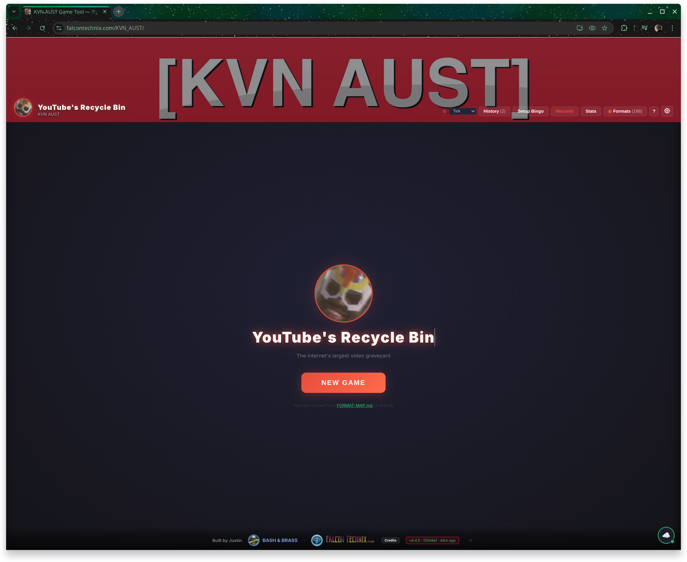
  <br><sub>Start Screen, YouTube's Recycle Bin</sub>
</p>

<p align="center">
  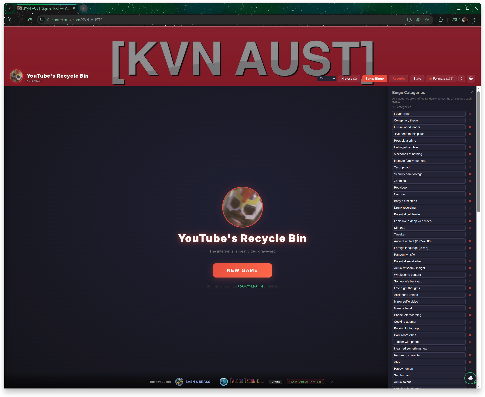
  <br><sub>Bingo Setup, 101 customizable categories</sub>
</p>

<p align="center">
  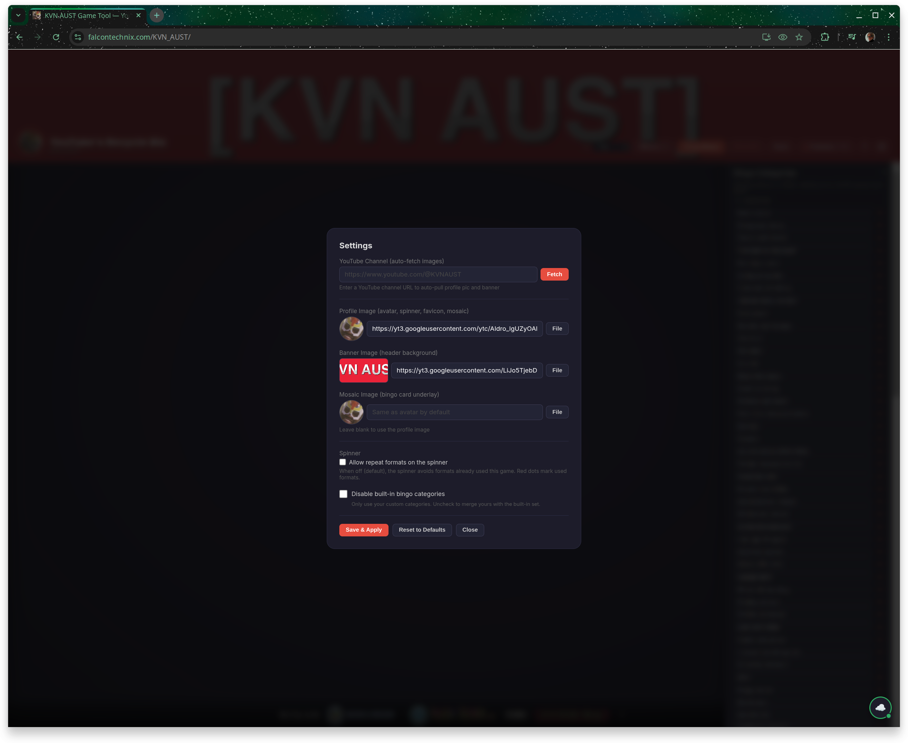
  <br><sub>Settings, channel images, spinner options, daub colors</sub>
</p>

<p align="center">
  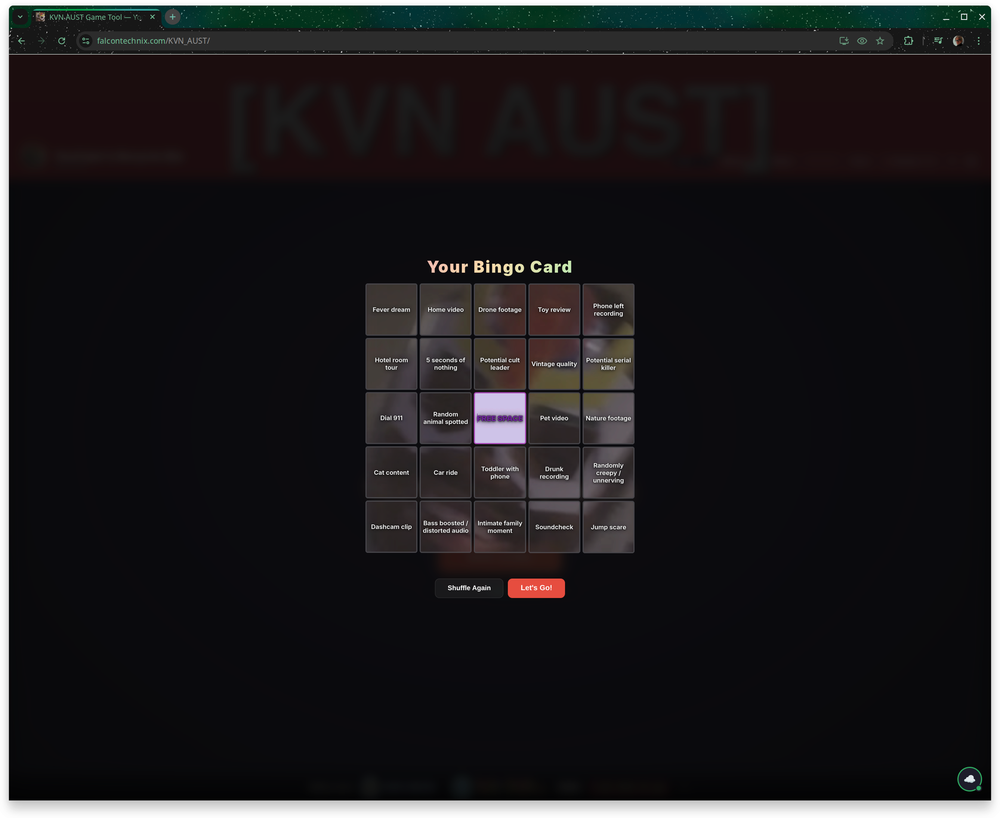
  <br><sub>Bingo Card Reveal, slide puzzle with mosaic</sub>
</p>

<p align="center">
  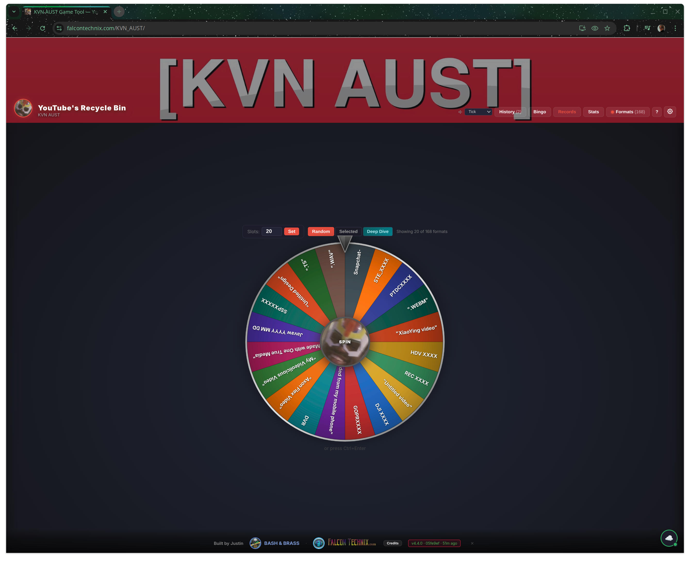
  <br><sub>3D Format Spinner, 426 formats from the community map (KVN Map 5.0)</sub>
</p>

<p align="center">
  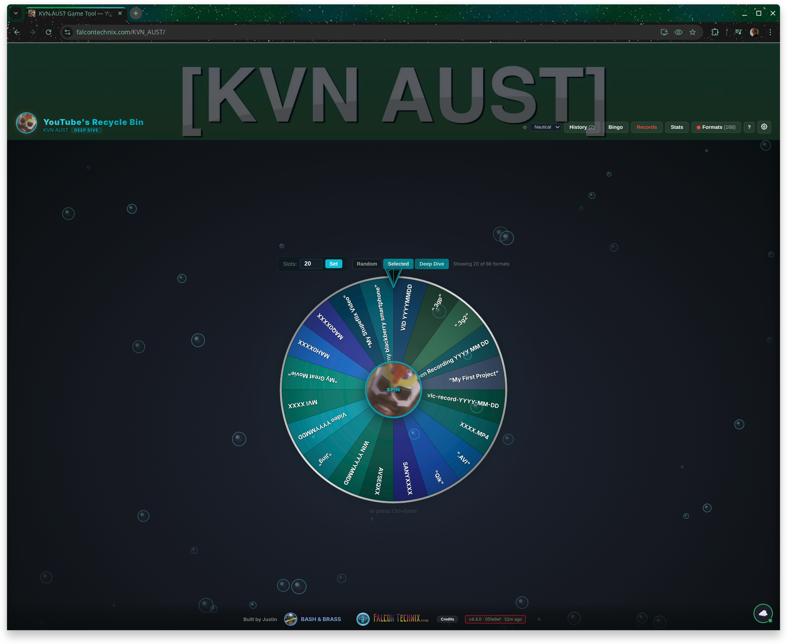
  <br><sub>Deep Dive Mode, underwater theme, Before:2010 filter, nautical sounds</sub>
</p>

<p align="center">
  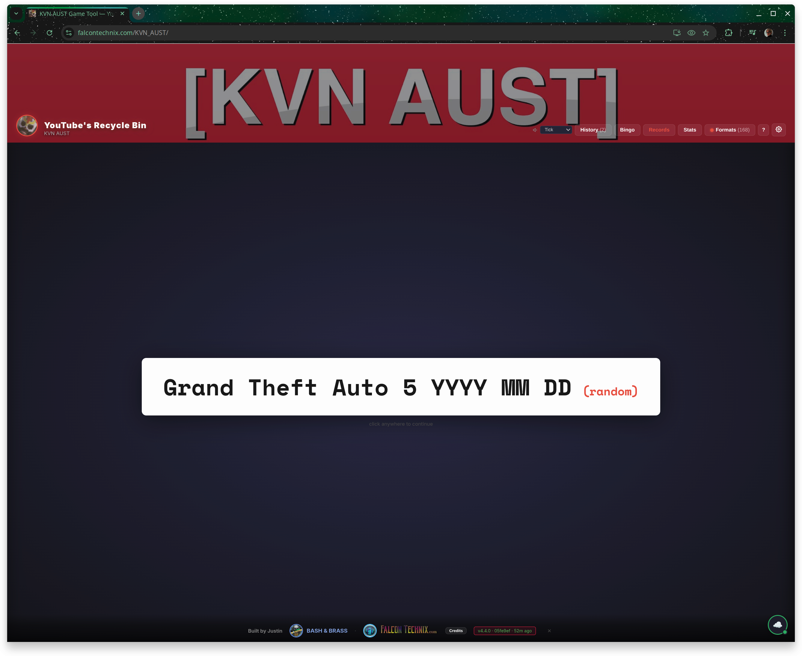
  <br><sub>Format Selected, rainbow reveal animation</sub>
</p>

<p align="center">
  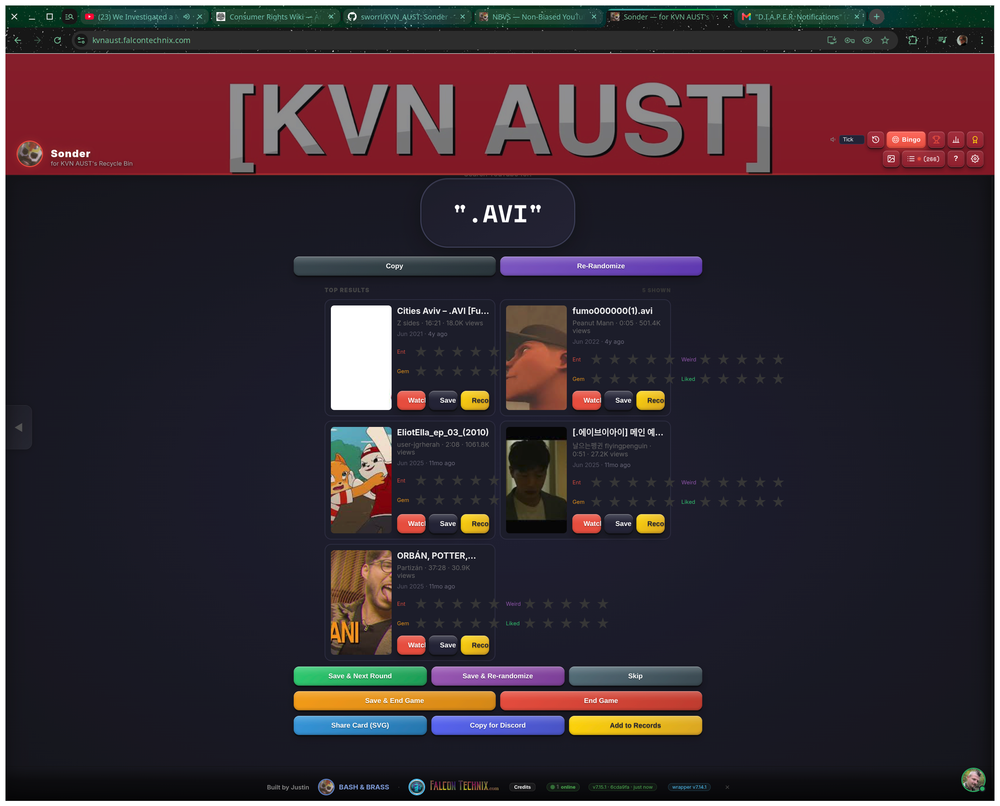
  <br><sub>Result Screen, Top 5 inline results sorted by 0-view → oldest, with Watch / Save / Record and "View All N →"</sub>
</p>

<p align="center">
  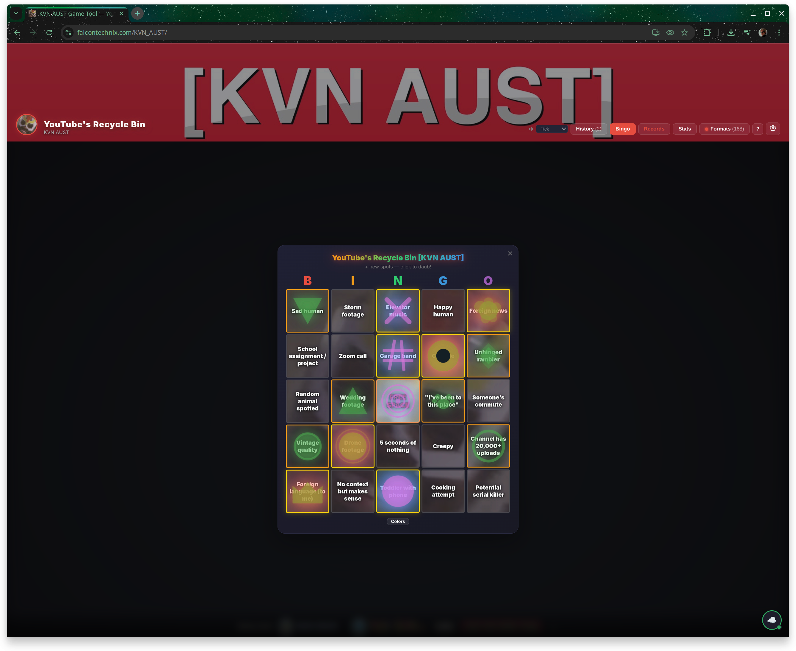
  <br><sub>Live Bingo Card, progressive daub stamps that glow near BINGO</sub>
</p>

<p align="center">
  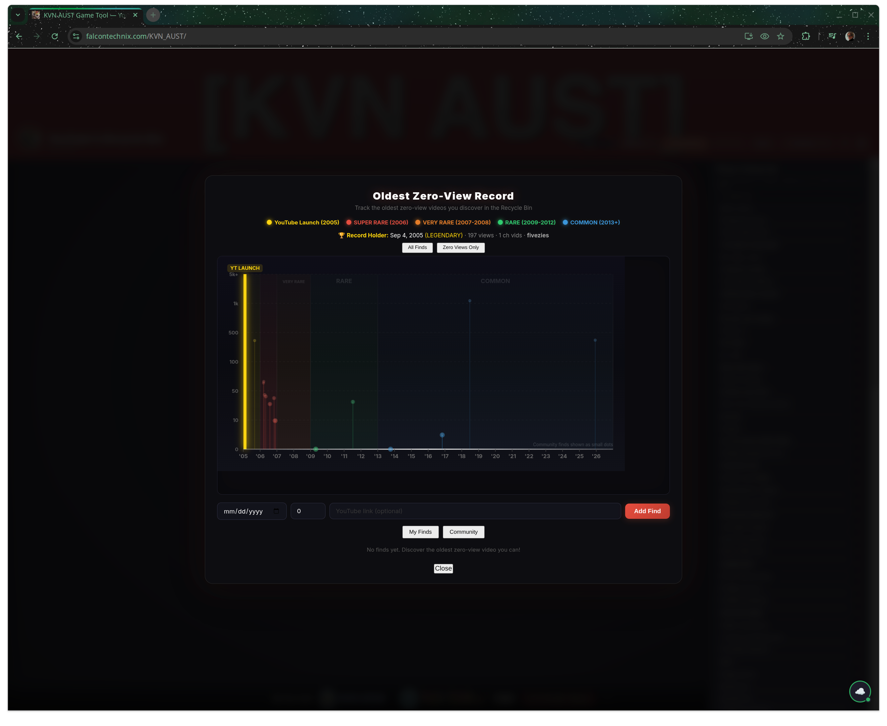
  <br><sub>Oldest Zero-View Records, community leaderboard with rarity tiers</sub>
</p>

<p align="center">
  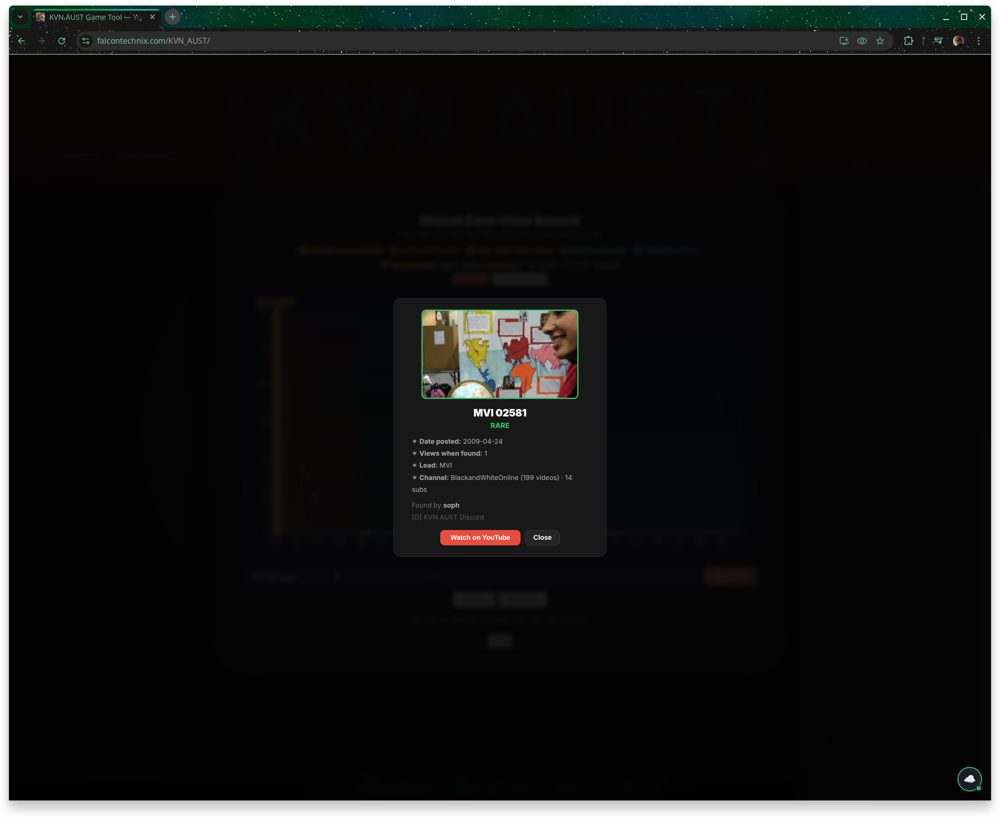
  <br><sub>Find Detail, click any dot for video info, channel stats, attribution</sub>
</p>

---

## Features

<table>
<tr><td>

**Core**
- Single HTML file, no install, no build step, no dependencies
- Works offline via service worker (full PWA)
- Runs on Windows, Mac, Linux, Chromebook, mobile, any browser
- 426 formats parsed from FORMAT-MAP.md (KVN Map 5.0), zero hardcoded
- **Format category filter**, browse by type: Numbered · Keyphrases · Extensions · Date-Based · Ancient YT · Special; stacks with live text search and a ★ Favorites filter
- **Era micro-timeline** on date formats: their active years on a 2005–2026 track
- Embedded Web Audio (tick, retro, casino, nautical Deep Dive presets)
- 15 achievements with badge modal, toast + sound on unlock
- Keyboard shortcuts (`?` to list them) and a reduced-motion mode

</td><td>

**Online (Hosted)**
- Live format sync from [FORMAT-MAP.md](FORMAT-MAP.md) every 30 minutes
- Password-backed cloud save for game history
- Community finds leaderboard with live API
- Auto-updates within 5 minutes of a push
- **Inline Top Results**, top 5 search results per round, sorted 0-view → pre-2008 → oldest; colored meta; Watch/Save/Record per card; "View All N" full modal
- **Mid-game resume**, sessionStorage checkpoint survives page refresh; resume modal shows session stats
- **Found It popup**, Watch, Discord, Copy Link, Close; confetti on LEGENDARY/zero-view
- **Power Search** with your own API key: view counts, fewest-views sort, Shorts filter, 50 results per page

</td></tr>
<tr><td>

**Recycle Bin Bingo**
- 101 categories from KVN AUST originals + community
- Mosaic slide-puzzle reveal with real 15-puzzle physics
- Progressive daub stamps that glow near BINGO
- 50 unique SVG stamp designs, customizable colors
- **Pre-game setup**: configurable Lose-a-Space slot count (0–10), Free Space toggle
- **Peek + undo**: long-press a cell to read it, Undo Daub for misclicks
- **32 auto-rotating wheel palettes** (rotate daily or every 2 saved games), optional category-colored slices
- **2 app themes** (Default · Deep Dive), persists across sessions
- **Bottom bar auto-hides** during gameplay, returns at game end (unless you've X'd it manually)
- Export completed cards as SVG

</td><td>

**Tracking & Scoring**
- 4 rating metrics: Entertainment, Weirdness, Gem Factor, "I Just Liked It"
- Oldest Zero-View Record timeline with zoom/pan and rarity tiers
- Era + rarity forecast on every date-based spin
- Video gallery with thumbnail grid, search, and sort
- Deep Dive mode: underwater theme, Before:2010 filter, poppable bubbles
- Share cards (SVG), PNG spin cards to clipboard, and Copy for Discord
- Holiday easter eggs (10 holidays + KVN AUST's birthday)

</td></tr>
</table>

---

## Free, Forever, No Catch

> **TL;DR, [Download `kvnaust-recyclebin.html`](kvnaust-recyclebin.html), open it in any browser, and you're playing the full game. That's it. No install, no account, no internet required after the first format sync.**

The game tool in this repo (`kvnaust-recyclebin.html` + `bingo-categories.json`) is **GPL-3.0**. Fork it, host it, mod it, run it offline; do whatever you want. No attribution required to KVN AUST or to us, though it'd be cool of you.

**We actively encourage you to run it locally.** The whole tool is one HTML file. Drop it on a thumb drive, host it on your own server, embed it in a side project. Go nuts. You don't need us, and we don't want you to feel like you do.

**The only reason to play on [kvnaust.falcontechnix.com](https://kvnaust.falcontechnix.com/) is if you want the community layer:** cloud save across devices, leaderboards, player profiles, multiplayer co-watching, discovery pages, daily challenges, season events. We pay for that hosting out of our own pocket because we think it's fun.

**No ads. No paywalls. No tracking pixels. No "premium" tier. No "donate to unlock." No monetization. Not now, not ever.** If we ever change our minds, the offline copy in this repo will keep working forever; that's what GPL-3.0 protects. Pick whichever side suits you.

---

## Play Now

### Online (Recommended)

> **[Play YouTube's Recycle Bin at kvnaust.falcontechnix.com](https://kvnaust.falcontechnix.com/)**, always up to date, cloud save, community leaderboard, and more.

The hosted version (wrapper v7.15.6) wraps the same HTML (v7.20.0) from this repo with exclusive features:

| Feature | Hosted | Standalone |
|:--------|:------:|:----------:|
| Full game (spinner, bingo, achievements, gallery, Deep Dive, favorites, era forecast) | Yes | Yes |
| Format sync, Share Card / PNG spin card / Discord copy | Yes | Yes |
| Power Search with your own API key | Yes | Yes |
| **Inline Search Results**: top 5 sorted cards (0-view → pre-2008 → oldest) with Watch/Save/Record; "View All N" modal; full-width on desktop (≥1100px, up to 1500px, smooth CSS transition) | Yes | No |
| **Mid-Game Resume**: refresh recovery modal with session stats, Resume / New Game options | Yes | No |
| **Found It Popup**: rarity + title + Watch / Discord / Copy Link / Close buttons; confetti on LEGENDARY | Yes | No |
| **Cloud Save**: game history, bingo state, settings synced across devices | Yes | No |
| **Player Profiles**: XP, levels, 28 badges, streaks, [shareable SVG cards](https://kvnaust.falcontechnix.com/profile_card.php?u=root) | Yes | No |
| **Seasons**: 90-day competitive windows with season leaderboards | Yes | No |
| **Multiplayer & Co-Watching**: SSE rooms + synchronized video playback on discovery pages | Yes | No |
| **Daily Challenges**: format-of-the-day with streak tracking and leaderboard | Yes | No |
| **Find Verification**: server validates videos exist and view count is plausible | Yes | No |
| **Discovery Pages**: every find gets a [permanent shareable URL](https://kvnaust.falcontechnix.com/discoveries/) with OG card | Yes | No |
| **Web Push**: notifications for record-broken, season events, verified finds | Yes | No |
| **Pattern Recommendations**: "users who found X also found Y" co-occurrence analysis | Yes | No |
| **Personal Webhooks**: Discord/Slack notifications on new finds and streaks | Yes | No |
| **Atom Feeds**: [community feed](https://kvnaust.falcontechnix.com/feed.xml) + per-user feeds | Yes | No |
| **JS SDK**: [`sdk.js`](https://kvnaust.falcontechnix.com/sdk.js) for third-party integrations | Yes | No |
| **Embed Widget**: iframe-ready latest-finds widget for any site | Yes | No |
| **[OpenAPI Spec](https://kvnaust.falcontechnix.com/openapi.json)**: full API documentation | Yes | No |
| **Update etiquette** (wrapper 7.15.5+): signed-in sessions get a dismissible "new version" toast instead of a forced reload, and "Later" is remembered per version | Yes | n/a |
| **[🦫 Go backend](CHANGELOG.md#700--2026-05-03--the-go-rewrite)** (v7.0.0), single static binary replaces 28 PHP files. p50 latency ~10× lower, hardened systemd sandbox, structured JSON logs. Same URLs, same DB, same response shapes. Wrapper source is proprietary; **none of this affects the standalone download**: that's still GPL-3.0 HTML. | Yes | No |

### Offline / Standalone

Download [`kvnaust-recyclebin.html`](kvnaust-recyclebin.html) and [`bingo-categories.json`](bingo-categories.json), place them in the same folder, and open in any browser. Everything runs locally, no internet required after download. Formats still sync from GitHub on first load if online.

---

## Community Finds API

The hosted version serves a public API of community-discovered zero-view YouTube videos. The standalone HTML polls this automatically.

| Endpoint | What |
|:---------|:-----|
| [`/finds.php`](https://kvnaust.falcontechnix.com/finds.php) | Leaderboard JSON, filter by `?category=`, `?source=`, `?found_by=`, `?season=current`, `?order=`, `?limit=` |
| [`/finds.php?heatmap=1`](https://kvnaust.falcontechnix.com/finds.php?heatmap=1) | Category × decade heatmap matrix |
| [`/finds.php?heatmap=date`](https://kvnaust.falcontechnix.com/finds.php?heatmap=date) | Year × month matrix by upload date |
| `/discoveries/<video_id>` | Permanent shareable page with OG card and co-watch |
| [`/profile.php?u=<name>`](https://kvnaust.falcontechnix.com/profile.php?u=root) | Player profile: level, XP, 28 badges, rank, streaks |
| [`/profile.php?u=A&vs=B`](https://kvnaust.falcontechnix.com/profile.php?u=root&vs=root) | Side-by-side player comparison |
| [`/profile_card.php?u=<name>`](https://kvnaust.falcontechnix.com/profile_card.php?u=root) | 1200×630 SVG share card |
| [`/badges.php?u=<name>`](https://kvnaust.falcontechnix.com/badges.php?catalog=1) | Player badges + full badge catalog |
| [`/clusters.php?reco=<name>`](https://kvnaust.falcontechnix.com/clusters.php?reco=root) | Pattern recommendations: leads to try next |
| [`/daily.php`](https://kvnaust.falcontechnix.com/daily.php) | Daily challenge + streak leaderboard |
| [`/random.php`](https://kvnaust.falcontechnix.com/random.php) | Random discovery redirect (or `?json=1`) |
| [`/feed.xml`](https://kvnaust.falcontechnix.com/feed.xml) | Community Atom feed |
| `/feed.php?u=<name>` | Per-user Atom feed |
| [`/status.php`](https://kvnaust.falcontechnix.com/status.php) | Live status: counts, online users, active season |
| [`/version.php`](https://kvnaust.falcontechnix.com/version.php) | Deployed game + wrapper versions, last sync time |
| [`/openapi.json`](https://kvnaust.falcontechnix.com/openapi.json) | OpenAPI 3.0 spec |

- **Rate limit**: 3 requests per 60 seconds per IP (ETag conditional GET is free)
- **Verified finds**: server validates videos exist and view count is ≤500 views
- **Seasons**: 90-day competitive windows, filter with `?season=current`
- **Daily challenges**: format-of-the-day with streak tracking
- **28 badges**: 15 in-game (client) + 13 wrapper-exclusive (server-verified achievements)

### Direct Links

| Link | Opens |
|:-----|:------|
| [kvnaust.falcontechnix.com/#records](https://kvnaust.falcontechnix.com/#records) | Records Timeline & Community Leaderboard |
| [kvnaust.falcontechnix.com/#stats](https://kvnaust.falcontechnix.com/#stats) | Stats Dashboard |
| [kvnaust.falcontechnix.com/#credits](https://kvnaust.falcontechnix.com/#credits) | Credits & Contributors |
| [kvnaust.falcontechnix.com/#shortcuts](https://kvnaust.falcontechnix.com/#shortcuts) | Keyboard Shortcuts |

### Community Leaderboard

> This table auto-updates every 3 hours from the [Finds API](https://kvnaust.falcontechnix.com/finds.php) via GitHub Actions. Do not edit manually, changes will be overwritten.
>
> The sync workflow authenticates with the host using an `X-KVN-Sync-Token` header. The token is stored as the `KVN_SYNC_TOKEN` repo secret; if it's ever rotated, update the secret in **Settings → Secrets and variables → Actions**, the next scheduled run picks it up.
>
> **Get on the leaderboard:** [Play the hosted version](https://kvnaust.falcontechnix.com/) and create an account. Submit a validated zero-view video during gameplay or directly via the [Records timeline](https://kvnaust.falcontechnix.com/#records), you don't need to play a full game to submit a find. See also: [Discord Integration Guide](DISCORD_INTEGRATION.md)

<!-- LEADERBOARD-START -->
**27 community finds** — oldest: 2005-09-05 · newest: 2025-12-10 · [Full record →](RECORDS.md)

#### ⭐ Zero-View Finds (1)

| # | Rarity | Date Posted | Lead | Found By |
|:-:|:-------|:-----------|:-----|:---------|
| 🥇 | 🔵 **COMMON** | [2014-01-26](https://youtube.com/watch?v=KDjg3E7PVPA) | `P100XXXX` | **Eurrl** |

#### Top Finds by Age (19 shown · 26 total with views)

| # | Rarity | Date Posted | Views | Lead | Found By |
|:-:|:-------|:-----------|------:|:-----|:---------|
| 1 | 🏆 LEGENDARY | [2005-09-05](https://youtube.com/watch?v=ExMSFNh7Sp0) | 197 | `testing before:2007` | fivezies |
| 2 | 🔴 SUPER RARE | [2006-01-26](https://youtube.com/watch?v=NmK5LQc8sBs) | 61 | `—` | Ross from wii music |
| 3 | 🔴 SUPER RARE | [2006-02-06](https://youtube.com/watch?v=Q1dL1RtGSGo) | 32 | `james before:2007` | Ross from wii music |
| 4 | 🔴 SUPER RARE | [2006-03-14](https://youtube.com/watch?v=7tH0sdugVEU) | 25 | `good show` | susgod_bro_69 |
| 5 | 🔴 SUPER RARE | [2006-03-20](https://youtube.com/watch?v=oP8jSAmt1M8) | 27 | `new` | susgod_bro_69 |
| 6 | 🔴 SUPER RARE | [2006-04-11](https://youtube.com/watch?v=qnBuwBBNeF0) | 14 | `kelly 5` | susgod_bro_69 |
| 7 | 🔴 SUPER RARE | [2006-05-04](https://youtube.com/watch?v=DuI02uPgDOs) | 13 | `testing before:2007` | fivezies |
| 8 | 🔴 SUPER RARE | [2006-08-01](https://youtube.com/watch?v=hzvZ2MtjrtA) | 9 | `You have new Picture M...` | fivezies |
| 9 | 🔴 SUPER RARE | [2006-08-10](https://youtube.com/watch?v=S4us9-y3KPE) | 8 | `taken by before:2007` | Ross from wii music |
| 10 | 🔴 SUPER RARE | [2006-09-17](https://youtube.com/watch?v=4sjnU5FxoTc) | 30 | `worry before:2007` | Ross from wii music |
| 11 | 🔴 SUPER RARE | [2006-10-17](https://youtube.com/watch?v=F1BA07OuiaA) | 280 | `—` | Eurrl |
| 12 | 🔴 SUPER RARE | [2006-10-30](https://youtube.com/watch?v=KeOXi_GyFdk) | 12 | `dustin before:2007` | Ross from wii music |
| 13 | 🔴 SUPER RARE | [2006-11-10](https://youtube.com/watch?v=VTI2rcYCk8k) | 21 | `andre before:2007` | Ross from wii music |
| 14 | 🔴 SUPER RARE | [2006-11-14](https://youtube.com/watch?v=MHZmEcDUSA0) | 175 | `"My Great Movie"` | Eurrl |
| 15 | 🔴 SUPER RARE | [2006-11-24](https://youtube.com/watch?v=kj0CI8tQzbE) | 4 | `testing before:2007` | Ross from wii music |
| 16 | 🔴 SUPER RARE | [2006-11-27](https://youtube.com/watch?v=aldCnMwoQhA) | 253 | `—` | Ross from wii music |
| 17 | 🟢 RARE | [2009-01-28](https://youtube.com/watch?v=ktWZiOebkxM) | 112 | `"My Great Movie"` | Eurrl |
| 18 | 🟢 RARE | [2009-04-24](https://youtube.com/watch?v=o2DY-QOs6RY) | 1 | `MVI` | soph |
| 19 | 🟢 RARE | [2011-07-09](https://youtube.com/watch?v=z-QCzV5FLWk) | 10 | `.mts` | Ross from wii music |

*[See all 27 finds →](RECORDS.md) · Live at [kvnaust.falcontechnix.com/#records](https://kvnaust.falcontechnix.com/#records)*
<!-- LEADERBOARD-END -->

---

## The Recycle Bin Format Map

> **[VIEW THE COMPLETE FORMAT MAP](FORMAT-MAP.md)**

The community-maintained database of every known default filename keyphrase that surfaces YouTube's hidden zero-view video graveyard. Organized by search keyphrases, file extensions, numbered device formats, date-based formats, and ancient YouTube (2006-2008) patterns. **432 map entries** (KVN AUST Map 5.0), **426 auto-loaded by the spinner**, the rest documented as manual-substitution patterns, **136 contributors**.

The spinner reads the map's tables directly, so a lead only needs to land in the right table shape to show up on the wheel within 30 minutes on the hosted version. Multi-variable patterns and exotic date orders stay in the bullet lists as manual-substitution leads.

---

## Bingo Categories

[`bingo-categories.json`](bingo-categories.json) contains 101 categories compiled from KVN AUST's original Recycle Bin bingo cards and community fan variants.

- **Hosted**: fetched automatically at load time
- **Offline**: place the JSON next to the HTML (embedded fallback if missing)
- **Editable**: customize via the Setup Bingo panel or edit the JSON directly

---

## Contributing

1. **New format leads**: Add to [FORMAT-MAP.md](FORMAT-MAP.md) via PR. Each numbered format is a table row with four columns: the keyphrase in backticks ending with 1–4 `X` characters (e.g. `formatXXXX`), the numeric range written as `MIN-MAX` digits (e.g. `0000-9999`), the source device or context, and contributor credit. Date formats take a date style column instead (compact, spaced, dashed, `DDMMYYYY`, `MM DD YYYY`, year-only, `YYMMDD`, `Month DD, YYYY`) plus the years the device was active. The spinner parser reads these tables directly; incorrect formatting will cause the format to be skipped.
2. **New bingo categories**: Add to [`bingo-categories.json`](bingo-categories.json) via PR
3. **Code changes**: Edit [`kvnaust-recyclebin.html`](kvnaust-recyclebin.html) and bump **both** version blocks at the bottom of the file (`app-version-data` and `app-manifest`) to the same version, then add a [CHANGELOG.md](CHANGELOG.md) entry. Wrapper-side changes go in [WRAPPER_CHANGELOG.md](WRAPPER_CHANGELOG.md) on their own cadence.
4. **NBVS itself**: it's KVN's project. Open issues and PRs at [kvnaust/YouTube-NonBiasedVideoSearcher](https://github.com/kvnaust/YouTube-NonBiasedVideoSearcher); the FT mirror picks up merged changes automatically within 30 minutes.

---

## Credits

- **[KVN AUST](https://www.youtube.com/@KVNAUST)** ([@MingKasterMK](https://x.com/MingKasterMK)), Creator of YouTube's Recycle Bin series, the Format Maps, and NBVS
- **Justin** ([@Chegnus](https://x.com/Chegnus)) / [BASH & BRASS](https://www.youtube.com/@BASHnBRASS) / [FalconTechnix](https://www.falcontechnix.com), Tool Development & Hosting
- **[136 community contributors](FORMAT-MAP.md#contributors)**, Format discovery & verification

---

<p align="center">
  <sub>GPL-3.0 | <a href="https://github.com/sworrl/KVN_AUST">GitHub</a> | <a href="https://kvnaust.falcontechnix.com/">Play Now</a> | <a href="https://nbvs.falcontechnix.com/">NBVS</a> | <a href="FORMAT-MAP.md">Format Map</a> | <a href="RECORDS.md">All Records</a> | <a href="SOLVED_MYSTERIES.md">Solved Mysteries</a> | <a href="DISCORD_INTEGRATION.md">Discord</a> | <a href="CHANGELOG.md">Game Changelog</a> | <a href="WRAPPER_CHANGELOG.md">Wrapper Changelog</a></sub>
</p>
